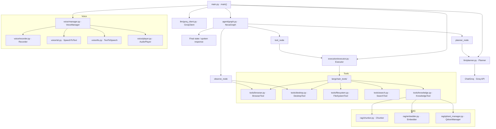
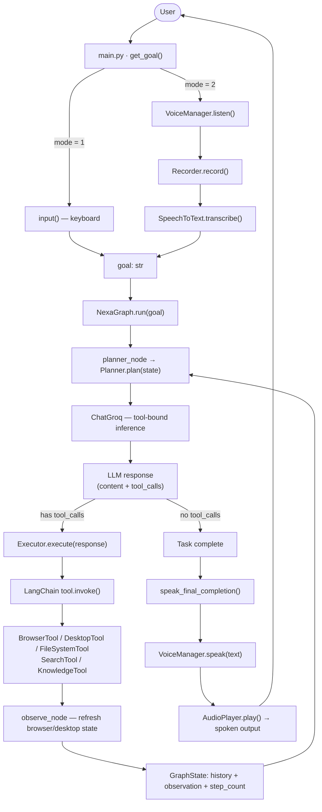

# Nexa

<p align="center">
  
  
  
  
  
  
</p>

> Voice-first autonomous AI agent that plans tool use with LangGraph, executes one action at a time, and operates across browser, desktop, filesystem, search, knowledge, and speech I/O.

---

## Overview

Nexa combines an LLM planner, a single-action executor, and an observation step into a bounded agent loop. The entry point [`main.py`](main.py) wires real tool instances into [`NexaGraph`](agent/graph.py) and runs them against a Groq-backed chat model.

The agent operates over the browser, local desktop, files, and web search — while also supporting microphone input and spoken output through the `voice/` package. A local Qdrant-backed knowledge store enables document ingestion and semantic retrieval. Prompt-level memory is handled in [`llm/planner.py`](llm/planner.py), which references `user_info.txt` and the knowledge tools for remembered facts and retrieved context.

---

## Key Features

- **LangGraph control flow** — explicit `planner → tool → observe` state transitions compiled in [`agent/graph.py`](agent/graph.py)
- **Single-action enforcement** — [`execution/executor.py`](execution/executor.py) rejects multi-action LLM responses; exactly one tool call per step
- **Browser automation** — Playwright persistent Chromium contexts with stable `element_id` mappings so the LLM acts on integers, not fragile CSS selectors ([`tools/browser.py`](tools/browser.py))
- **Desktop control** — window listing, switching, app launch/kill, typing, hotkeys, and active-window inspection via `pyautogui` / `pywinauto` ([`tools/desktop.py`](tools/desktop.py))
- **Filesystem operations** — recursive search, read/write/append, create file/folder, and directory listing ([`tools/filesystem.py`](tools/filesystem.py))
- **RAG knowledge base** — chunks text, embeds with Ollama `nomic-embed-text`, stores in local Qdrant, and retrieves by semantic similarity ([`rag/`](rag/))
- **Voice I/O** — microphone capture with silence detection, Deepgram STT/TTS, and `pygame` playback coordinated by [`voice/manager.py`](voice/manager.py)
- **Web search** — Tavily-backed online search when the answer is not in memory or local knowledge ([`tools/search.py`](tools/search.py))

---

## Architecture Diagram



---

## Agent Flow



---

## Tech Stack

| Layer | Technology | Version | Purpose |
|-------|-----------|---------|---------|
| Runtime | Python, venv | 3.12.1 | Local execution environment |
| Orchestration | LangGraph | 1.2.6 | State-machine: plan → execute → observe |
| LLM | LangChain + Groq | latest | Tool-bound planning via Groq chat models |
| Browser | Playwright | 1.60.0 | Persistent Chromium automation and DOM observation |
| Desktop | pyautogui, pygetwindow, pywinauto, pywin32 | — | Window management, typing, hotkeys (Windows only) |
| Filesystem | pathlib, os | stdlib | Local file discovery and mutation |
| Web search | tavily-python | — | Online search fallback |
| Knowledge base | qdrant-client, ollama, numpy, scipy | — | Chunk → embed → store → retrieve local docs |
| Voice I/O | deepgram-sdk, sounddevice, pygame | — | Mic capture, STT, TTS, audio playback |
| Config | python-dotenv | — | Load API keys from `.env` |

---

## Project Structure

```
Nexa/
├── main.py                   # Entry point — wires tools, planner, executor, voice I/O
├── test.py                   # Voice interaction smoke test
├── test2.py                  # LangChain + Groq tool-binding smoke test
├── user_info.txt             # Prompt-referenced memory file for user facts
├── .env                      # API keys (Groq, Tavily, Deepgram) — never commit this
│
├── agent/
│   ├── graph.py              # NexaGraph — LangGraph StateGraph with 3 nodes
│   ├── loop.py               # Legacy manual agent loop
│   └── state.py              # Typed state definitions for manual loop
│
├── config/
│   └── settings.py           # Runtime constants (Ollama URL, data paths)
│
├── execution/
│   └── executor.py           # Dispatches exactly one LLM tool call per step
│
├── langchain_tools/
│   ├── all_tools.py          # Aggregates all LangChain tool wrappers
│   ├── browser_tools.py      # LangChain wrappers for BrowserTool
│   ├── desktop_tools.py      # LangChain wrappers for DesktopTool
│   ├── filesystem_tools.py   # LangChain wrappers for FileSystemTool
│   ├── knowledge_tools.py    # LangChain wrappers for KnowledgeTool
│   └── search_tools.py       # LangChain wrappers for SearchTool
│
├── llm/
│   ├── groq_client.py        # Groq chat client initialisation
│   ├── planner.py            # Prompt construction + tool-bound LLM call
│   └── ollama_client.py      # Placeholder (unused)
│
├── observation/
│   └── observer.py           # Thin adapter → calls tool.observe()
│
├── rag/
│   ├── chunker.py            # Fixed-size overlapping text chunker
│   ├── embedder.py           # Ollama nomic-embed-text wrapper
│   └── qdrant_manager.py     # Local Qdrant collection: insert, search, delete
│
├── tools/
│   ├── browser.py            # Playwright controller with element_id mapping
│   ├── desktop.py            # Desktop/window/process automation
│   ├── filesystem.py         # File and folder operations
│   ├── knowledge.py          # Document ingestion and semantic retrieval
│   └── search.py             # Tavily web search
│
├── voice/
│   ├── manager.py            # Coordinates record → transcribe → synthesise → play
│   ├── recorder.py           # Mic capture with silence detection
│   ├── stt.py                # Deepgram speech-to-text client
│   ├── tts.py                # Deepgram text-to-speech client
│   ├── player.py             # pygame audio playback helper
│   └── config.py             # Deepgram + recording constants
│
└── data/
    ├── browser_data/         # Persistent Playwright Chromium profile
    ├── qdrant/               # Local Qdrant vector storage
    └── screenshots/          # Screenshot output directory
```

---

## Getting Started

### Prerequisites

| Requirement | Notes |
|-------------|-------|
| Windows 10/11 | Desktop automation uses `pywinauto`, `pywin32`, `os.startfile` — Linux/macOS unsupported |
| Python 3.12.1 | Match this version exactly to avoid dependency conflicts |
| Ollama | Must be running locally on `http://localhost:11434` for RAG embeddings |
| Groq API key | For LLM inference — [console.groq.com](https://console.groq.com) |
| Tavily API key | For web search — [app.tavily.com](https://app.tavily.com) |
| Deepgram API key | For STT + TTS — [console.deepgram.com](https://console.deepgram.com) |
| Microphone + speakers | Required for voice mode (`mode = 2`) only |

### Installation

**1. Clone the repository**
```bash
git clone https://github.com/Atithi2908/Agent_NEXA.git
cd Agent_NEXA
```

**2. Create and activate a virtual environment**
```bash
python -m venv venv
venv\Scripts\activate
```

**3. Install dependencies**
```bash
python -m pip install `
    python-dotenv langchain langchain-core langchain-groq langgraph groq `
    playwright tavily-python deepgram-sdk qdrant-client ollama numpy scipy `
    sounddevice pygame psutil pyautogui pygetwindow pywinauto pywin32
```

**4. Install Playwright browser**
```bash
python -m playwright install chromium
```

**5. Configure environment variables**
```bash
cp .env.example .env
# then open .env and fill in your keys
```

**6. Start Ollama and pull the embedding model**
```bash
ollama serve
ollama pull nomic-embed-text
```

**7. Run Nexa**
```bash
python main.py
```

> **Input mode:** By default `main.py` uses voice input (`mode = 2`). Change `mode = 1` in `main.py` for keyboard input.

---

## Environment Variables

| Variable | Required | Default | Description |
|----------|----------|---------|-------------|
| `GROQ_API_KEY` | ✅ Yes | — | Used by `llm/groq_client.py` to initialise the Groq chat model for all planning calls |
| `TAVILY_API_KEY` | ✅ Yes | — | Used by `tools/search.py` to run web searches via Tavily |
| `DEEPGRAM_API_KEY` | ✅ Yes | — | Used by `voice/stt.py` (transcription) and `voice/tts.py` (synthesis) |

> All three keys are mandatory. The agent will fail to start if any are missing from `.env`.

---

## API Reference

Nexa does not expose an HTTP API. The public surface is the Python class and function set below.

### Core Orchestration

| Class / Function | Parameters | Returns | Description |
|-----------------|-----------|---------|-------------|
| `main.main()` | — | None | Builds tool instances, wires `NexaGraph`, runs the interactive loop |
| `NexaGraph(planner, executor, tools)` | `planner`, `executor`, `tools` | `NexaGraph` | Compiles the LangGraph `StateGraph` |
| `NexaGraph.run(goal)` | `goal: str` | `dict` (final graph state) | Initialises `GraphState` and invokes the compiled graph |
| `Planner.plan(state)` | `state: GraphState` | LLM response object | Renders prompt, binds tools, calls Groq model |
| `Executor.execute(response)` | `response` with `tool_calls` | tool result or `None` | Dispatches exactly one tool call; rejects multi-action responses |

### Browser Tool · `tools/browser.py`

| Method | Parameters | Returns | Description |
|--------|-----------|---------|-------------|
| `BrowserTool.navigate(url)` | `url: str` | `dict` | Opens a URL in the persistent Playwright context |
| `BrowserTool.click(selector, element_id)` | selector or `element_id: int` | `dict` | Clicks a visible element by selector or observation-time `element_id` |
| `BrowserTool.type(selector, element_id, text)` | selector or `element_id`, `text: str` | `dict` | Types into a browser element |
| `BrowserTool.press(key)` | `key: str` | `dict` | Sends a keyboard key to the active page |
| `BrowserTool.observe()` | — | `dict` | Returns page title, URL, and visible elements with `element_id` mappings |
| `BrowserTool.close()` | — | `dict` | Closes the Playwright context |

### Desktop Tool · `tools/desktop.py`

| Method | Parameters | Returns | Description |
|--------|-----------|---------|-------------|
| `DesktopTool.open_app(app_name)` | `app_name: str` | `dict` | Launches an app via the Windows Start menu |
| `DesktopTool.close_app(app_name)` | `app_name: str` | `dict` | Kills matching `*.exe` processes |
| `DesktopTool.switch_window(target)` | `target: str` | `dict` | Activates the first window whose title contains `target` |
| `DesktopTool.list_open_apps()` | — | `dict` | Returns current open window titles |
| `DesktopTool.type_text(text)` | `text: str` | `dict` | Types into the active window |
| `DesktopTool.press_key(key)` | `key: str` | `dict` | Sends a key press to the active window |
| `DesktopTool.hotkey(keys)` | `keys: list[str]` | `dict` | Sends a keyboard shortcut |
| `DesktopTool.observe()` | — | `dict` | Returns active window title and open-window list |

### Filesystem Tool · `tools/filesystem.py`

| Method | Parameters | Returns | Description |
|--------|-----------|---------|-------------|
| `FileSystemTool.find_file(filename)` | `filename: str` | `dict` | Recursively searches `Path.home()` for matching files |
| `FileSystemTool.find_folder(folder_name)` | `folder_name: str` | `dict` | Recursively searches `Path.home()` for matching folders |
| `FileSystemTool.list_directory(path)` | `path: str` | `dict` | Lists directory contents |
| `FileSystemTool.read_file(path)` | `path: str` | `dict` | Reads up to 2000 characters from a file |
| `FileSystemTool.write_file(path, content)` | `path: str`, `content: str` | `dict` | Overwrites a file |
| `FileSystemTool.append_file(path, content)` | `path: str`, `content: str` | `dict` | Appends to an existing file |
| `FileSystemTool.create_file(path)` | `path: str` | `dict` | Creates an empty file |
| `FileSystemTool.create_folder(path)` | `path: str` | `dict` | Creates a directory tree |
| `FileSystemTool.open_file(path)` | `path: str` | `dict` | Opens a file with the default Windows app |

### Knowledge Tool · `tools/knowledge.py`

| Method | Parameters | Returns | Description |
|--------|-----------|---------|-------------|
| `KnowledgeTool.add_document(path)` | `path: str` | `dict` | Chunks, embeds, and stores a document in Qdrant |
| `KnowledgeTool.retrieve(question, limit)` | `question: str`, `limit: int = 5` | `dict` | Retrieves the most semantically relevant chunks |

### Search & Voice

| Method | Parameters | Returns | Description |
|--------|-----------|---------|-------------|
| `SearchTool.search(query)` | `query: str` | `dict` | Tavily web search — answer + source summaries |
| `VoiceManager.listen()` | — | `str` | Records audio, transcribes, deletes temp WAV, returns text |
| `VoiceManager.speak(text)` | `text: str` | None | Synthesises + plays speech, deletes generated MP3 |

### RAG Components · `rag/`

| Class / Method | Parameters | Returns | Description |
|---------------|-----------|---------|-------------|
| `Chunker.chunk_text(text)` | `text: str` | `list[str]` | Fixed-size overlapping chunks |
| `Embedder.embed(text)` | `text: str` | `list[float]` | Calls `ollama.embeddings()` with `nomic-embed-text` |
| `QdrantManager.create_collection()` | — | None | Creates `knowledge_base` collection if absent |
| `QdrantManager.insert_chunk(...)` | `chunk_id`, `chunk_text`, `embedding`, `source` | None | Inserts a vector + payload into Qdrant |
| `QdrantManager.search(query_embedding, limit)` | `query_embedding`, `limit: int = 5` | `list` | Queries the local Qdrant collection |
| `QdrantManager.delete_source(source)` | `source: str` | None | Deletes all chunks for a source before re-ingestion |

---

## How It Works

1. **Startup** — `main.py` loads `.env`, instantiates all tool objects, connects them to LangChain wrappers, and builds a `GroqClient` + `Planner` / `Executor` pair.

2. **Input** — `get_goal()` either reads a string from `input()` (mode 1) or records audio via `Recorder`, transcribes with `SpeechToText`, and returns the goal string (mode 2).

3. **Planning** — `planner_node` calls `Planner.plan(state)`, which formats a prompt from `goal`, `history`, and `observation`, then invokes `ChatGroq` with all tools bound. The LLM returns a response with `tool_calls`.

4. **Execution** — `tool_node` calls `Executor.execute(response)`, which enforces a single tool call per step and dispatches it through `tool.invoke()`. Multi-action responses are rejected outright.

5. **Observation** — `observe_node` calls `tool.observe()` on browser or desktop to refresh the current UI state, appending the result to `GraphState.history` so the next planning step is grounded.

6. **Completion** — when the LLM returns no `tool_calls`, the loop exits and `speak_final_completion()` passes the result through `VoiceManager.speak()` for audio output.

---

## Contributing

1. Fork the repository and create a feature branch
```bash
git checkout -b feature/your-feature
```
2. Make focused changes that preserve the agent loop and tool contracts
3. Run the relevant smoke test (`test.py` for voice, `test2.py` for tool binding)
4. Commit with a descriptive message
```bash
git commit -m "feat: describe what you changed"
```
5. Push and open a pull request against `main`

No formatter config is checked in — follow the existing code style in whatever files you touch and keep changes small and explicit.