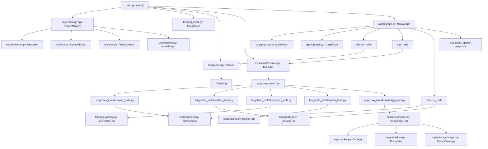

# Nexa


Nexa is a voice-first autonomous Python agent that plans tool use with LangGraph, executes one action at a time, and closes the loop with browser, desktop, filesystem, search, knowledge, and speech I/O integrations.

## Overview

Nexa combines an LLM planner, a single-action executor, and an observation step into a bounded agent loop. The current entry point is [main.py](main.py), which wires real tool instances into [NexaGraph](agent/graph.py) and runs them against a Groq-backed chat model. The agent can operate over the browser, local desktop, files, web search, and a local Qdrant-backed knowledge store, while also supporting microphone input and spoken output through the `voice/` package. Prompt-level memory handling is built into [llm/planner.py](llm/planner.py), which references `user_info.txt` and the knowledge tools for remembered facts and retrieved context.

## Key Features

- LangGraph-based control flow in [agent/graph.py](agent/graph.py) with explicit `planner -> tool -> observe` transitions.
- Tool execution is constrained to a single tool call per step in [execution/executor.py](execution/executor.py); multi-action responses are rejected.
- Browser automation uses Playwright persistent contexts rooted at `./data/browser_data` in [tools/browser.py](tools/browser.py).
- Browser observations assign stable `element_id` values and maintain an internal `element_id_map` so the LLM can act on integers instead of fragile selectors.
- Desktop control covers window listing, window switching, app launch/kill, typing, hotkeys, and active-window inspection in [tools/desktop.py](tools/desktop.py).
- Filesystem operations support search, read/write, append, create-file, create-folder, and directory listing in [tools/filesystem.py](tools/filesystem.py).
- Knowledge ingestion chunks text, embeds it with Ollama `nomic-embed-text`, and stores vectors in a local Qdrant collection in [rag/](rag).
- Voice mode records audio from the microphone, transcribes with Deepgram, synthesizes speech with Deepgram, and plays audio with `pygame` through [voice/manager.py](voice/manager.py).

## Architecture Diagram



## User Flow / Agent Flow

```mermaid
graph LR
    User[User input] --> GetGoal["main.py: get_goal()"]
    GetGoal -->|mode = 1| Keyboard["input()"]
    GetGoal -->|mode = 2| Listen["VoiceManager.listen()"]
    Listen --> Record["Recorder.record()"]
    Record --> Transcribe["SpeechToText.transcribe()"]
    Keyboard --> Goal[goal string]
    Transcribe --> Goal

    Goal --> Run["NexaGraph.run()"]
    Run --> PlannerNode[planner_node]
    PlannerNode --> Plan["Planner.plan()"]
    Plan --> Prompt["ChatPromptTemplate.from_template()"]
    Prompt --> LLM[GroqClient / ChatGroq]
    LLM --> Response[LLM response with content + tool_calls]

    Response --> Execute["Executor.execute()"]
    Execute --> ToolCall["LangChain tool.invoke()"]
    ToolCall --> ToolImpl[BrowserTool / DesktopTool / FileSystemTool / SearchTool / KnowledgeTool]

    ToolImpl --> Observe[observe_node]
    Observe --> StateUpdate[GraphState history / observation / step_count]
    StateUpdate --> PlannerNode

    Response -->|no tool_calls| Complete[Task completed]
    Complete --> Speak["speak_final_completion()"]
    Speak --> TTS["VoiceManager.speak()"]
    TTS --> Render["TextToSpeech.synthesize()"]
    Render --> Play["AudioPlayer.play()"]
    Play --> Output[spoken output]
```



## Tech Stack

| Layer | Technology | Purpose |
| --- | --- | --- |
| Runtime | Python 3.12.1, `venv` | Local execution environment for the agent and tools |
| Orchestration | `langgraph` 1.2.6 | State-machine workflow for planning, tool execution, and observation |
| LLM | `langchain`, `langchain-core`, `langchain-groq`, `groq` | Tool-bound planning with Groq-backed chat models |
| Browser automation | `playwright` 1.60.0 | Persistent Chromium automation and DOM observation |
| Desktop automation | `pyautogui`, `pygetwindow`, `pywinauto`, `psutil`, `pywin32` | Window management, typing, hotkeys, and process control on Windows |
| Filesystem | `pathlib`, `os` | Local file discovery and file mutation |
| Web search | `tavily-python` | Online search when the answer is not in memory or local knowledge |
| Knowledge base | `qdrant-client`, `ollama`, `numpy`, `scipy` | Chunk, embed, store, and retrieve local documents |
| Voice I/O | `deepgram-sdk`, `sounddevice`, `pygame` | Microphone capture, speech-to-text, text-to-speech, and playback |
| Configuration | `python-dotenv` | Load API keys from `.env` |

## Project Structure

```text
Nexa/
├── .env # Local API keys for Groq, Tavily, and Deepgram.
├── .gitignore # Excludes the virtual environment, generated browser data, screenshots, and logs.
├── main.py # Entry point that wires tools, planner, executor, and voice I/O.
├── README.md # Project documentation.
├── response.mp3 # Generated audio output from text-to-speech.
├── test.py # Voice interaction smoke test.
├── test2.py # LangChain + Groq tool-binding smoke test.
├── user_info.txt # Prompt-referenced memory file for user facts and reminders.
├── agent/
│   ├── graph.py # LangGraph orchestration and state transitions.
│   ├── loop.py # Legacy/manual agent loop implementation.
│   └── state.py # Typed state definitions for the manual loop.
├── config/
│   └── settings.py # Hardcoded runtime constants for Ollama and data paths.
├── data/
│   ├── browser_data/ # Persistent Playwright Chromium profile and cache.
│   ├── qdrant/ # Local Qdrant storage for the knowledge base.
│   └── screenshots/ # Output directory for screenshots.
├── execution/
│   └── executor.py # Dispatches one LLM tool call per step.
├── langchain_tools/
│   ├── all_tools.py # Aggregates all LangChain tool wrappers.
│   ├── browser_tools.py # LangChain wrapper functions for BrowserTool.
│   ├── desktop_tools.py # LangChain wrapper functions for DesktopTool.
│   ├── filesystem_tools.py # LangChain wrapper functions for FileSystemTool.
│   ├── knowledge_tools.py # LangChain wrapper functions for KnowledgeTool.
│   └── search_tools.py # LangChain wrapper functions for SearchTool.
├── llm/
│   ├── groq_client.py # Groq chat client specialization.
│   ├── ollama_client.py # Empty placeholder module.
│   └── planner.py # Prompt construction and tool-bound planning.
├── observation/
│   └── observer.py # Thin adapter that calls `tool.observe()`.
├── rag/
│   ├── chunker.py # Fixed-size text chunking for retrieval ingestion.
│   ├── embedder.py # Ollama embedding wrapper.
│   └── qdrant_manager.py # Local Qdrant collection and query manager.
├── tools/
│   ├── browser.py # Playwright browser controller with element-id mapping.
│   ├── desktop.py # Desktop/window/process automation.
│   ├── filesystem.py # File and folder operations.
│   ├── knowledge.py # Document ingestion and retrieval.
│   └── search.py # Tavily-backed web search.
├── venv/ # Local Python virtual environment.
└── voice/
    ├── config.py # Deepgram and recording constants.
    ├── manager.py # Coordinates recording, transcription, synthesis, and playback.
    ├── player.py # Audio playback helper.
    ├── recorder.py # Microphone capture and silence detection.
    ├── stt.py # Deepgram speech-to-text client.
    └── tts.py # Deepgram text-to-speech client.
```

## Getting Started

### Prerequisites

- Windows 10/11. The desktop automation layer uses `pyautogui`, `pygetwindow`, `pywinauto`, and `os.startfile`.
- Python 3.12.1. The checked-in virtual environment is based on the local `venv` at [venv/](venv/).
- Playwright 1.60.0 with Chromium available locally.
- Groq API access via `GROQ_API_KEY`.
- Tavily API access via `TAVILY_API_KEY`.
- Deepgram API access via `DEEPGRAM_API_KEY`.
- Ollama running locally on `http://localhost:11434` for embeddings used by [rag/embedder.py](rag/embedder.py).
- A microphone and speakers if you plan to use voice mode.

### Installation

1. Clone the repository.

```bash
git clone https://github.com/Atithi2908/Agent_NEXA.git
cd NEXA
```

2. Create and activate a virtual environment.

```bash
python -m venv venv
venv\Scripts\activate
```

3. Install the direct runtime dependencies used by the codebase.

```bat
python -m pip install ^
    python-dotenv langchain langchain-core langchain-groq langgraph groq ^
    playwright tavily-python deepgram-sdk qdrant-client ollama numpy scipy ^
    sounddevice pygame psutil pyautogui pygetwindow pywinauto pywin32
```

4. Install the Playwright browser binary.

```bash
python -m playwright install chromium
```

5. Configure the environment variables in `.env`.

```env
GROQ_API_KEY=your_groq_key
TAVILY_API_KEY=your_tavily_key
DEEPGRAM_API_KEY=your_deepgram_key
```

6. Start Ollama and pull the embedding model used by the RAG layer.

```bash
ollama serve
ollama pull nomic-embed-text
```

7. Run the agent.

```bash
python main.py
```

By default, [main.py](main.py) uses voice input (`mode = 2`). Change `mode` to `1` in [main.py](main.py) if you want keyboard input instead of microphone capture.

## Environment Variables

| Variable | Required | Default | Description |
| --- | --- | --- | --- |
| `GROQ_API_KEY` | Yes | `unset` | API key used by [llm/groq_client.py](llm/groq_client.py) and [main.py](main.py) to create the chat model. |
| `TAVILY_API_KEY` | Yes | `unset` | API key used by [tools/search.py](tools/search.py) for web search. |
| `DEEPGRAM_API_KEY` | Yes | `unset` | API key used by [voice/config.py](voice/config.py), [voice/stt.py](voice/stt.py), and [voice/tts.py](voice/tts.py). |

## API Reference

Nexa does not expose an HTTP API. The core public surface is the Python class and function set below.

### Core Orchestration

| Function / Class | Parameters | Returns | Description |
| --- | --- | --- | --- |
| `main.main()` | None | None | Builds tool instances, binds them into `NexaGraph`, and runs the interactive agent loop. |
| `agent.graph.NexaGraph(planner, executor, tools)` | `planner`, `executor`, `tools` | `NexaGraph` instance | Compiles the LangGraph workflow used by the current entry point. |
| `NexaGraph.run(goal)` | `goal: str` | Final graph state dict | Initializes `GraphState` and invokes the compiled graph. |
| `llm.planner.Planner.plan(state)` | `state: GraphState` | LLM response object | Renders the prompt, binds tools, and invokes the Groq chat model. |
| `execution.executor.Executor.execute(response)` | `response` with `tool_calls` | Tool result or `None` | Dispatches exactly one LangChain tool call. |

### Tool Implementations

| Function / Class | Parameters | Returns | Description |
| --- | --- | --- | --- |
| `tools.browser.BrowserTool.navigate(url)` | `url: str` | `dict` | Opens a URL in the persistent Playwright context. |
| `BrowserTool.click(selector=None, element_id=None)` | selector or `element_id` | `dict` | Clicks a visible browser element using a selector or the observation-time `element_id`. |
| `BrowserTool.type(selector=None, element_id=None, text="")` | selector or `element_id`, `text` | `dict` | Types text into a browser element. |
| `BrowserTool.press(key)` | `key: str` | `dict` | Sends a keyboard key to the browser page. |
| `BrowserTool.observe()` | None | `dict` | Returns page title, URL, and visible buttons/links/inputs with `element_id` mappings. |
| `BrowserTool.close()` | None | `dict`/`None` | Closes the Playwright context. |
| `tools.desktop.DesktopTool.open_app(app_name)` | `app_name: str` | `dict` | Launches an application using the Windows Start menu. |
| `DesktopTool.close_app(app_name)` | `app_name: str` | `dict` | Kills matching `*.exe` processes. |
| `DesktopTool.switch_window(target)` | `target: str` | `dict` | Activates the first open window whose title contains `target`. |
| `DesktopTool.list_open_apps()` | None | `dict` | Returns the current window titles. |
| `DesktopTool.type_text(text)` | `text: str` | `dict` | Types into the active window. |
| `DesktopTool.press_key(key)` | `key: str` | `dict` | Sends a key press to the active window. |
| `DesktopTool.hotkey(keys)` | `keys: list[str]` | `dict` | Sends a keyboard shortcut. |
| `DesktopTool.observe()` | None | `dict` | Returns the active window title and open-window list. |
| `tools.filesystem.FileSystemTool.find_file(filename)` | `filename: str` | `dict` | Searches `Path.home()` recursively for matching files. |
| `FileSystemTool.find_folder(folder_name)` | `folder_name: str` | `dict` | Searches `Path.home()` recursively for matching folders. |
| `FileSystemTool.list_directory(path)` | `path: str` | `dict` | Lists the contents of a directory. |
| `FileSystemTool.open_file(path)` | `path: str` | `dict` | Opens a file with the default Windows application. |
| `FileSystemTool.create_file(path)` | `path: str` | `dict` | Creates an empty file. |
| `FileSystemTool.create_folder(path)` | `path: str` | `dict` | Creates a directory tree. |
| `FileSystemTool.read_file(path)` | `path: str` | `dict` | Reads up to 2000 characters from a file. |
| `FileSystemTool.write_file(path, content)` | `path: str`, `content: str` | `dict` | Overwrites a file. |
| `FileSystemTool.append_file(path, content)` | `path: str`, `content: str` | `dict` | Appends content to an existing file. |
| `tools.knowledge.KnowledgeTool.add_document(path)` | `path: str` | `dict` | Chunks, embeds, and stores a document in Qdrant. |
| `KnowledgeTool.retrieve(question, limit=5)` | `question: str`, `limit: int` | `dict` | Retrieves the most relevant chunks from Qdrant. |
| `tools.search.SearchTool.search(query)` | `query: str` | `dict` | Searches the web through Tavily and returns answer plus source summaries. |
| `voice.manager.VoiceManager.listen()` | None | `str` | Records audio, transcribes it, and removes the temporary WAV file. |
| `VoiceManager.speak(text)` | `text: str` | None | Synthesizes speech and plays it back, then deletes the generated MP3. |
| `observation.observer.Observer.observe(tool)` | `tool` with `observe()` | tool result | Thin adapter that forwards observation to the provided tool. |

### RAG Components

| Function / Class | Parameters | Returns | Description |
| --- | --- | --- | --- |
| `rag.chunker.Chunker.chunk_text(text)` | `text: str` | `list[str]` | Produces fixed-size overlapping chunks. |
| `rag.embedder.Embedder.embed(text)` | `text: str` | `list[float]` | Calls `ollama.embeddings()` with `nomic-embed-text`. |
| `rag.qdrant_manager.QdrantManager.create_collection()` | None | None | Creates the local `knowledge_base` collection if it does not exist. |
| `QdrantManager.insert_chunk(...)` | `chunk_id`, `chunk_text`, `embedding`, `source` | None | Inserts a single vector payload into Qdrant. |
| `QdrantManager.search(query_embedding, limit=5)` | `query_embedding`, `limit` | `list` | Queries the local Qdrant collection. |
| `QdrantManager.delete_source(source)` | `source: str` | None | Deletes all chunks for a source file before re-ingesting it. |

## How It Works

- [main.py](main.py) loads `.env`, instantiates the real tool objects, connects them to the LangChain wrappers, and builds a `GroqClient` plus `Planner`/`Executor` pair.
- [agent/graph.py](agent/graph.py) compiles a `StateGraph` with three nodes: `planner_node`, `tool_node`, and `observe_node`.
- `Planner.plan()` in [llm/planner.py](llm/planner.py) formats the prompt from `goal`, `history`, and `observation`, then calls the Groq chat model with `ALL_TOOLS` bound.
- `Executor.execute()` in [execution/executor.py](execution/executor.py) enforces one tool call per step and dispatches the selected tool through `tool.invoke()`.
- `observe_node` refreshes browser or desktop state after each action and appends the latest result to `history`, which keeps the next planning step grounded in the current UI state.

## Contributing

1. Fork the repository and create a feature branch.
2. Make focused changes that preserve the current agent loop and tool contracts.
3. Run the relevant smoke test or entry point, depending on the area you changed.
4. Commit with a clear message and open a pull request.

No formatter or linter configuration is checked in. Follow the existing code style in the touched files and keep changes small and explicit.